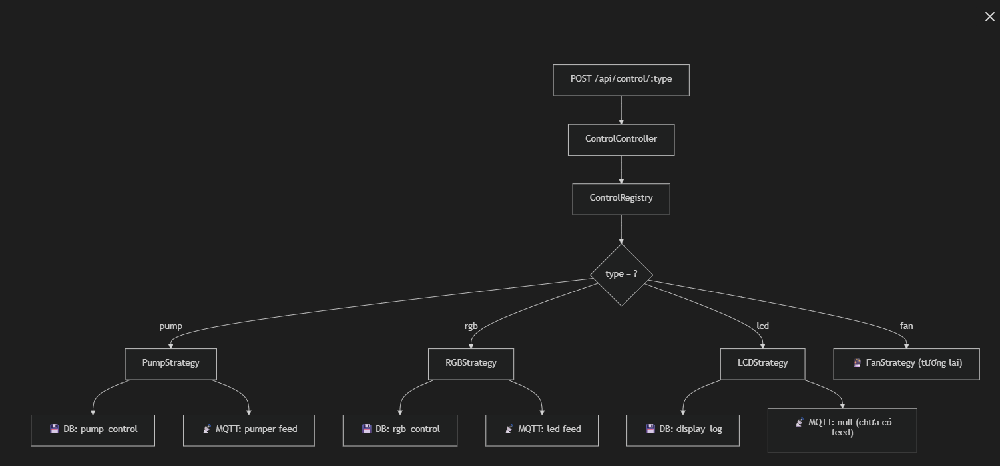

# Phần 4: Module Điều khiển Thiết bị — Thiết kế & Hướng dẫn

## Kiến trúc: Strategy + Registry Pattern

## Cấu trúc file

```
src/modules/control/
├── strategies/
│   ├── device-control.interface.ts   ← Interface chung
│   ├── pump.strategy.ts              ← Máy bơm
│   ├── rgb.strategy.ts               ← Đèn LED RGB
│   └── lcd.strategy.ts               ← Màn hình LCD
├── control.registry.ts               ← Đăng ký strategy
├── control.dto.ts                    ← Zod validation
├── control.controller.ts             ← Controller duy nhất
└── control.route.ts                  ← 2 routes xử lý tất cả
```

## API Endpoints

| Method | Endpoint | Mô tả |
|--------|----------|-------|
| `POST` | `/api/control/pump` | Bật/tắt máy bơm |
| `POST` | `/api/control/rgb` | Điều khiển đèn LED RGB |
| `POST` | `/api/control/lcd` | Gửi text lên màn hình LCD |
| `GET` | `/api/control/:type/history?deviceId=...&page=1&limit=10` | Lịch sử điều khiển |

## Request/Response Examples

### Pump
```json
// POST /api/control/pump
{
    "deviceId": "uuid-of-pump-device",
    "isOn": true,
    "reason": "Manual: watering plants"  // optional
}

// Response 201
{
    "success": true,
    "message": "pump control command sent",
    "data": {
        "record": { "id": "...", "deviceId": "...", "isOn": true, "reason": "..." },
        "mqttPublished": true
    }
}
```

### RGB LED
```json
// POST /api/control/rgb
{
    "deviceId": "uuid-of-led-device",
    "isOn": true,
    "color": { "r": 255, "g": 0, "b": 100 }  // bắt buộc khi isOn=true
}
// Khi tắt:
{ "deviceId": "...", "isOn": false }
```

### LCD
```json
// POST /api/control/lcd
{
    "deviceId": "uuid-of-lcd-device",
    "content": "Temp: 28C Hum: 65%"  // max 32 ký tự (16×2)
}
```

## MQTT Mapping

| Strategy | Feed trên Adafruit IO | Giá trị gửi |
|----------|----------------------|-------------|
| Pump | `Phan_Gia_Phuc/feeds/pumper` | `"1"` (on) / `"0"` (off) |
| RGB | `Phan_Gia_Phuc/feeds/led` | `"#FF0064"` (hex) / `"0"` (off) |
| LCD | *chưa có feed* | Chỉ lưu DB |

## ✅ Cách thêm thiết bị mới (ví dụ: Quạt)

Chỉ cần **3 bước**:

### Bước 1: Tạo file strategy
```typescript
// src/modules/control/strategies/fan.strategy.ts
import { DeviceType } from '@prisma/client';
import type { IDeviceControlStrategy, ... } from './device-control.interface';

export class FanStrategy implements IDeviceControlStrategy {
    readonly deviceType = DeviceType.FAN;  // cần thêm vào enum
    readonly mqttFeed = 'fan';
    // ... implement execute(), getHistory(), formatMqttValue()
}
```

### Bước 2: Thêm Zod schema
```typescript
// control.dto.ts
export const FanControlSchema = z.object({ ... });
controlSchemas['fan'] = FanControlSchema;
```

### Bước 3: Đăng ký vào registry
```typescript
// control.registry.ts
import { FanStrategy } from './strategies/fan.strategy';
registry.register('fan', new FanStrategy());
```

> [!IMPORTANT]
> Không cần sửa Controller, Route, hay bất kỳ file nào khác!

## ⚠️ Lưu ý

> [!WARNING]
> **MQTT_URL trong `.env`** hiện đang là `https://io.adafruit.com/api/v2` (HTTP REST API URL). 
> Để MQTT hoạt động, cần đổi thành: `mqtts://io.adafruit.com:8883` hoặc `mqtt://io.adafruit.com:1883`.
> Hiện tại nếu MQTT chưa kết nối, API vẫn hoạt động bình thường (lưu DB thành công, `mqttPublished: false`).
